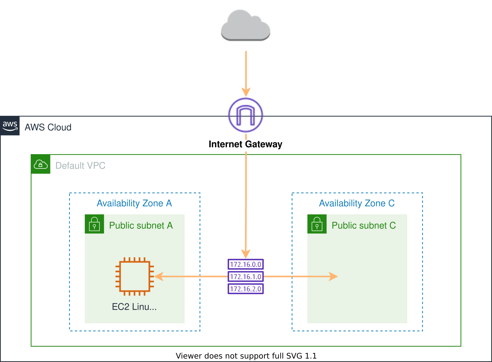
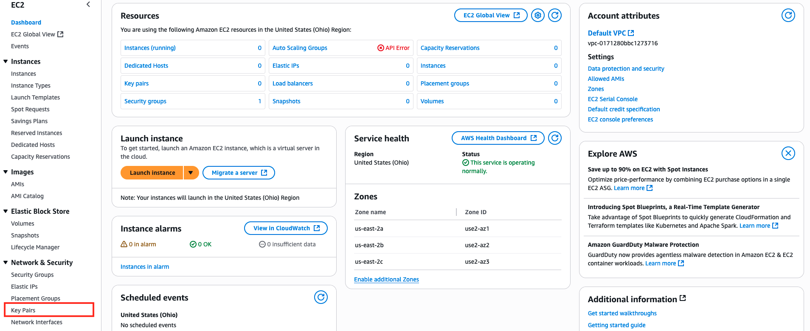

# Lab-1-imersion-day
Laboratório realizado durante o AWS Immersion Day (Dia 1), com foco na criação e configuração de instâncias EC2, VPC, sub-redes e grupos de segurança. Foram exploradas opções de conexão entre as instâncias usando SSH, terminal Linux e AWS Session Manager.

## Laboratório prático do EC2 Linux

## Visão geral do Amazon EC2

<a href="https://docs.aws.amazon.com/AWSEC2/latest/UserGuide/concepts.html" target="_blank">Amazon EC2</a> fornece capacidade computacional escalável na Nuvem Amazon Web Services (AWS). Ao usar o Amazon EC2, você elimina a necessidade de investir em hardware antecipadamente, permitindo desenvolver e implantar aplicativos com mais rapidez. Você pode iniciar quantos servidores virtuais precisar, configurar a segurança e a rede e gerenciar o armazenamento. O Amazon EC2 permite que você aumente ou diminua a escala para lidar com mudanças nos requisitos ou picos de tráfego, reduzindo a necessidade de prever a demanda.

  

## Crie seu próprio servidor web seguindo os laboratórios na ordem abaixo:
- [✔️] Tarefa 1 - Criar um novo par de chaves;
- [✔️] Tarefa 2 - Inicie uma instância do servidor web;
- [✔️] Tarefa 3 - Conecte-se à sua instância Linux.

> ⚠️ **Nota sobre o laboratório**  
> 
> 🕒 **Duração estimada:** aproximadamente **1 hora** para conclusão.  
> 💸 **Custos aproximados do workshop:**

| Serviço             | Custo por hora | Custo mensal |
|---------------------|----------------|---------------|
| Amazon EC2 - t2.micro | $0.0116        | $8.47         |
| Amazon EBS - 8 GB     | $0.0008        | $0.64         |

> 💰 **Custo total estimado do workshop:** **$0.0124 por hora** (~**$0.50** para o laboratório completo).
[Calculadora de rpeços AWS](https://calculator.aws/#/)

## Criar um novo par de chaves
Neste laboratório, você criará um par de chaves SSH que usará para acessar sua instância Linux EC2. Siga os passos abaixo para criar um par de chaves exclusivo para você.

1. Navegue até o console do Amazon EC2 . No canto superior direito do AWS Management Console, confirme se você está na região AWS desejada.
2. Clique em Pares de Chaves na seção Rede e Segurança, próximo ao final do menu à esquerda.

  

