# Lab-1-imersion-day
Laboratório realizado durante o AWS Immersion Day (Dia 1), com foco na criação e configuração de instâncias EC2, Par de chaves e grupos de segurança. Foram exploradas opções de conexão entre as instâncias usando SSH e conexão via PUTTY.


## Laboratório prático do EC2 Linux

## Visão geral do Amazon EC2

<div align="justify">
<a href="https://docs.aws.amazon.com/AWSEC2/latest/UserGuide/concepts.html" target="_blank">Amazon EC2</a> fornece capacidade computacional escalável na Nuvem Amazon Web Services (AWS). Ao usar o Amazon EC2, você elimina a necessidade de investir em hardware antecipadamente, permitindo desenvolver e implantar aplicativos com mais rapidez. Você pode iniciar quantos servidores virtuais precisar, configurar a segurança e a rede e gerenciar o armazenamento. O Amazon EC2 permite que você aumente ou diminua a escala para lidar com mudanças nos requisitos ou picos de tráfego, reduzindo a necessidade de prever a demanda.
</div>

<p align="center">
  
</p>

## Crie seu próprio servidor web seguindo os laboratórios na ordem abaixo:
## Sumário

- [✔️] [Tarefa 1 - Criar um novo par de chaves](#criar-um-novo-par-de-chaves)
- [✔️] [Tarefa 2 - Inicie uma instância do servidor web](#inicie-uma-instância-do-servidor-web)
- [✔️] [Tarefa 3 - Conecte-se à sua instância Linux (caso você use SO Linux)](#conecte-se-à-sua-instância-linux-caso-você-use-so-linux)
- [✔️] [Tarefa 4 - Conecte-se à instância EC2 usando PUTTY (caso você use SO Windows)](#conecte-se-à-instância-ec2-usando-putty-caso-você-use-so-windows)
- [✔️] [Tarefa 5 - Recursos de Limpeza](#recursos-de-limpeza)


> ⚠️ **Nota sobre o laboratório**  
> 
> 🕒 **Duração estimada:** aproximadamente **1 hora** para conclusão.  
> 💸 **Custos aproximados do workshop:**

| Serviço             | Custo por hora | Custo mensal |
|---------------------|----------------|---------------|
| Amazon EC2 - t2.micro | $0.0116        | $8.47         |
| Amazon EBS - 8 GB     | $0.0008        | $0.64         |

> 💰 **Custo total estimado do workshop:** **$0.0124 por hora** (~**$0.50** para o laboratório completo).
>
> 💲 [Calculadora de preços AWS](https://calculator.aws/#/)
>
> 🔒 **Importante:** Após concluir o laboratório, é altamente recomendável **encerrar todos os recursos criados** — como **instâncias EC2** e **grupos de segurança**(apesar de nao ser cobrado) — para **evitar custos adicionais** e manter seu sistema limpo em sua conta AWS.


## Criar um novo par de chaves
Neste laboratório, você criará um par de chaves SSH que usará para acessar sua instância Linux EC2. Siga os passos abaixo para criar um par de chaves exclusivo para você.

1. Navegue até o console do Amazon EC2 . No canto superior direito do AWS Management Console, confirme se você está na região AWS desejada.
2. Clique em **Pares de Chaves** na seção **Rede e Segurança**, próximo ao final do menu à esquerda.


3. Clique em Criar **par de chaves** no canto superior direito para criar o novo par de chaves SSH.
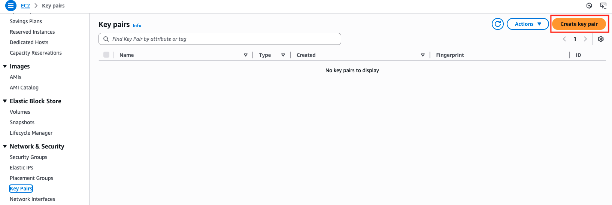

4. Digite **[Seu nome]-ImmersionDay-KeyPair** no nome do par de chaves.

- Se você estiver usando Linux/Mac como sua máquina local, selecione o formato de arquivo de chave privada **.pem**.

- Se você estiver usando o Windows como máquina local: Baixe o formato de arquivo **.ppk** ao criar seu par de chaves. Este formato é necessário para conexões PuTTY.

5. Em seguida, clique em **Criar par de chaves**.
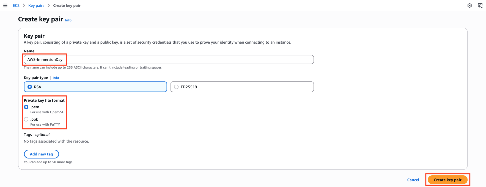

6. Um arquivo chamado **[Seu Nome]-ImmersionDay.pem** será baixado para o seu disco local. Salve o arquivo no local de download padrão. Anote o caminho completo para o arquivo do par de chaves que você acabou de baixar.
> Você usará o par de chaves que acabou de criar para gerenciar suas instâncias do EC2 durante o restante deste laboratório.

## Inicie uma instância do servidor web
Neste laboratório, você iniciará uma instância do Amazon Linux 2, inicializará o Apache/PHP e instalará uma página da web básica.

1. Entre no AWS Management Console e abra o Amazon EC2 Console . No canto superior direito do AWS Management Console, confirme que você está na **região AWS** desejada (Usamos US East (Norte Virginia) - us-east-1) .

2. No menu à esquerda, clique em **Painel** , em EC2. Em seguida, clique em **Iniciar instâncias**.
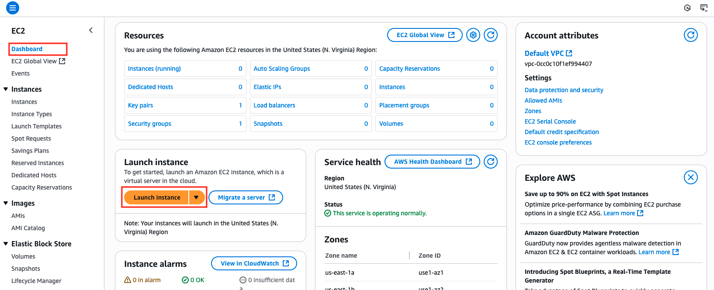

3. Em **Nome** , digite o valor **Servidor Web para IMD**. Em **Imagens de Aplicativo e SO (Imagem de Máquina da Amazon)**, deixe as configurações padrão.
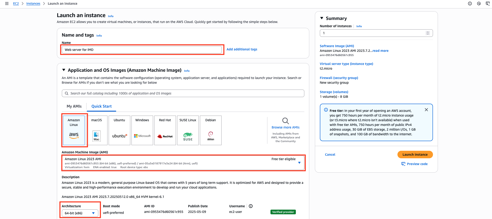

4. Selecione **t2.micro** em **Tipo de instância**.
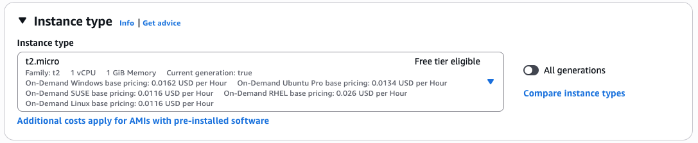

5. Selecione o par de chaves que você criou no início deste laboratório no menu suspenso.
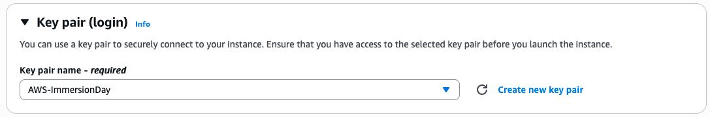

6. Em **Configurações de rede**, clique em **Editar**.


7. Deixe os valores padrão para **VPC** e **sub-rede** . **A atribuição automática de IP público** precisa ser definida para **habilitar**.

8. Em **Firewall (grupos de segurança)**, escolha **Criar grupo de segurança**. Digite **Dia de Imersão - Servidor Web** em Nome do grupo de segurança e Descrição.

9. Para **a regra de grupo de segurança 1** , deixe o **tipo** como **ssh** e altere **o Tipo de origem** para **Meu IP**.

10. Em seguida, selecione **Adicionar regra de grupo de segurança**.

11. Para **a regra de grupo de segurança 2** , defina o **Tipo** como **HTTP** e o **Tipo de origem** como **Meu IP** .


12. Deixe os valores padrão em Configurar armazenamento

13. Expanda os **Detalhes Avançados** . Em **Versão de Metadados**, selecione **Somente V2 (token necessário)** . Em **Dados do Usuário** , copie e cole o seguinte script
> copie clicando no ícone de cópia no canto superior direito.
```bash
#!/bin/sh
​
#Install a LAMP stack
dnf install -y httpd wget php-fpm php-mysqli php-json php php-devel
dnf install -y mariadb105-server
dnf install -y httpd php-mbstring
​
#Start the web server
chkconfig httpd on
systemctl start httpd
​
#Install the web pages for our lab
if [ ! -f /var/www/html/immersion-day-app-php7.zip ]; then
   cd /var/www/html
   wget -O 'immersion-day-app-php7.zip' 'https://static.us-east-1.prod.workshops.aws/ec4201ed-3f11-4553-98fa-fca51877e686/assets/immersion-day-app-php7.zip?Key-Pair-Id=K36Q2WVO3JP7QD&Policy=eyJTdGF0ZW1lbnQiOlt7IlJlc291cmNlIjoiaHR0cHM6Ly9zdGF0aWMudXMtZWFzdC0xLnByb2Qud29ya3Nob3BzLmF3cy9lYzQyMDFlZC0zZjExLTQ1NTMtOThmYS1mY2E1MTg3N2U2ODYvKiIsIkNvbmRpdGlvbiI6eyJEYXRlTGVzc1RoYW4iOnsiQVdTOkVwb2NoVGltZSI6MTc1MTQ3MTg3OH19fV19&Signature=d89x9eb1JjUqKsDDvumRFs5e-n~7oLDJ9M41jcek6kJoSiflRU8MKnj8~UIZWfmA~nqD47V7NM6IVJ1njhR8k1AJop4L6HlcA6M9Z7kUFFQddM0PLvTePm07eWkdrezVTQS1VZ3N6hglzJSQkB4sh7bjFZ4vQQAgCq0z8bmJuf7PPLrAjLTj2hv1m7CWRlLaEeeJL2jMGnEi2eze7O3IiYDQEYeU-Fxm8Jy1tfcbeKVAyPwrieV46B~GMehhYQ~gdfnNEsYW0jWVtrmH7ilR2W7FNuuRomhLlS40784hvXQdJX7OkOYyprsU1zYAVd7TA2EG8EO6IKbft0mQDZnsXA__'
   unzip immersion-day-app-php7.zip
fi
​
#Install the AWS SDK for PHP
if [ ! -f /var/www/html/aws.zip ]; then
   cd /var/www/html
   mkdir vendor
   cd vendor
   wget https://docs.aws.amazon.com/aws-sdk-php/v3/download/aws.zip
   unzip aws.zip
fi 

#Update existing packages
dnf update -y
````

14. Selecione **Iniciar instância**.
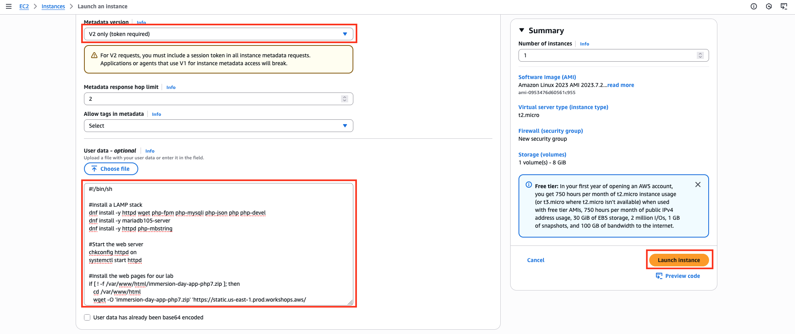

15. Selecione **Exibir todas as instâncias** no canto inferior direito para encontrar o servidor Web que você acabou de criar.

16. Clique na caixa de seleção ao lado do seu servidor web para visualizar detalhes sobre esta instância EC2. Encontre o **DNS público**; você usará este endereço mais tarde.
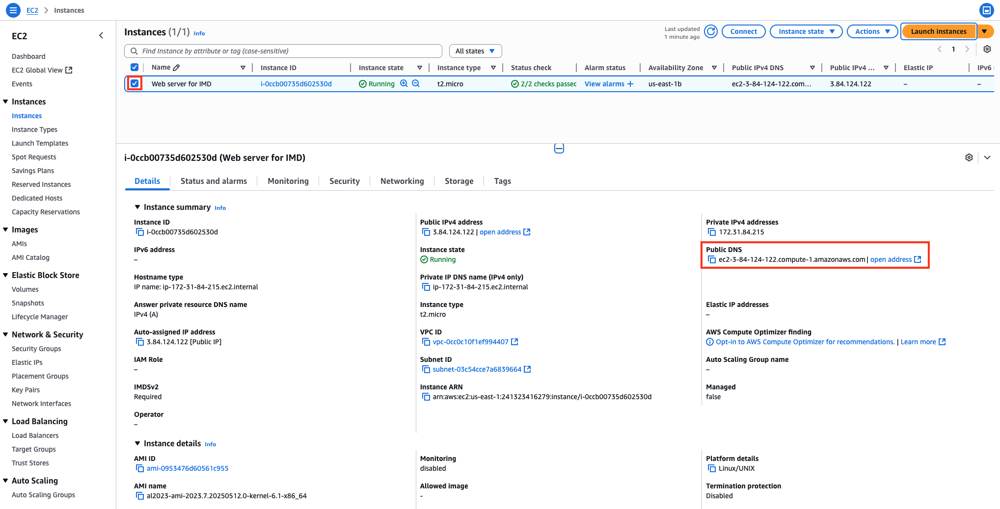

17. Navegar no servidor web
Aguarde a instância passar pelas **Verificações de Status** para concluir o carregamento. Abra uma nova aba do navegador e navegue pelo Servidor Web inserindo **o endereço DNS público** da sua instância EC2 .
> Se você estiver usando o navegador Chrome, ao colar o valor **DNS público** no navegador, ele poderá não funcionar se https for adicionado automaticamente antes do valor DNS. Portanto, é recomendável inserir **http://**.
Você deverá ver um site parecido com o seguinte:
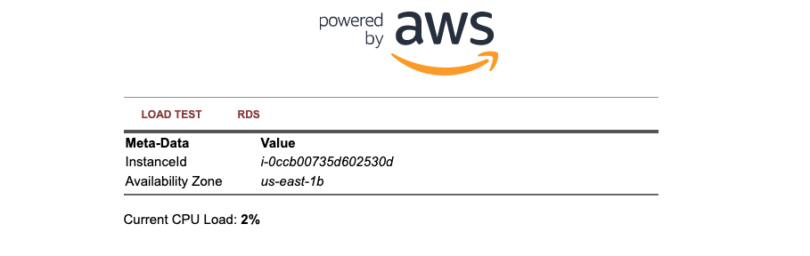

> até aqui Você implantou um servidor e lançou um site em questão de minutos!

## Conecte-se à sua instância Linux (caso você use S.O. Linux)
> Para se conectar à instância Linux, você usará um cliente SSH. Se você usa o Windows como computador local, vá para a próxima seção, [Conectando-se à sua instância Linux usando o PuTTY](#conecte-se-à-instância-ec2-usando-putty-caso-você-use-so-windows)
 . Para usuários de Mac, use o terminal local.

1. Localize seu servidor web navegando até o console do Amazon EC2 e selecionando **Instâncias** no menu do lado esquerdo.

2. Clique na caixa de seleção ao lado do seu servidor web e, em seguida, clique no botão **Conectar**.
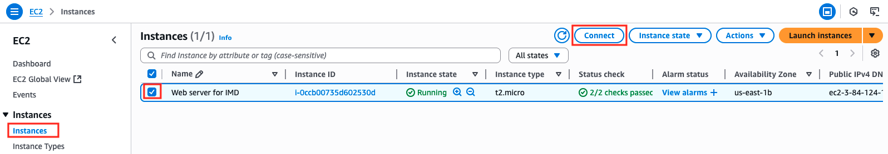

3. Selecione **o cliente SSH** e siga as instruções para se conectar à sua instância.
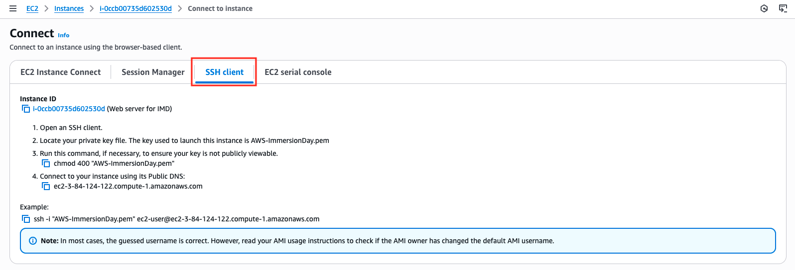

4. Navegue até o arquivo Downloads no seu computador local, onde sua chave privada está localizada. Em seguida, execute o comando chmod.

5. Em seguida, conecte-se à sua instância usando seu DNS público executando o comando ssh.

6. Digite **"sim"** para continuar conectando ao seu servidor web. Você pode conferir o resultado abaixo.
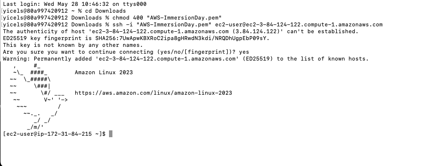

> Pronto! Você se conectou à sua instância do Linux EC2 usando cliente SSH

## Conecte-se à instância EC2 usando PuTTY (caso você use S.O. Windows)
1. Abra o aplicativo PuTTY.

2. No painel **Categoria** , escolha **Sessão**.

3. Digite **ec2-user@[seu IP público do EC2 que você criou]** no campo **Nome do Host**.

4. Defina o valor **da porta como 22**.


5. Selecione SSH como o tipo de conexão .

6. No painel **Categoria**, expanda Conexão, expanda **SSH** e escolha **Autenticação**.
Complete o seguinte:
- Selecione **Procurar**.
- Selecione o .ppkarquivo que você gerou para seu par de chaves e escolha **Abrir**.

7. Se esta for a primeira vez que você se conecta a esta instância, o PuTTY exibirá uma caixa de diálogo de alerta de segurança perguntando se você confia no host ao qual está se conectando. Selecione **Sim**. Uma janela será aberta. Faça login como **usuário ec2** e você estará conectado à sua instância.

> Pronto! Você se conectou à sua instância do Linux EC2 usando PUTTY

## Recursos de limpeza
Excluir instância do Amazon EC2
1. Navegue até o console do Amazon EC2 .

2. No painel de navegação, em **Instâncias**, escolha **Instâncias**. Em seguida, escolha a instância do EC2 que você criou neste laboratório.

3. No menu suspenso **Estado da instância**, selecione **Encerrar (excluir) instância**.


Você verá uma janela pop-up perguntando se tem certeza de que deseja encerrar esta instância. Clique em Encerrar .
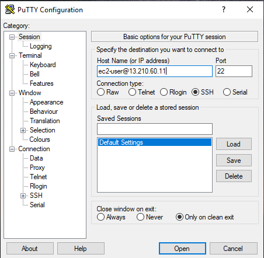

## 🎯 Conclusão do Laboratório

✅ Parabéns! Você concluiu com sucesso este laboratório prático na AWS.

Durante a atividade, você:

- Criou um **par de chaves SSH** para autenticação segura;
- Lançou uma **instância EC2** (servidor virtual na nuvem usado para hospedar aplicações e sites);
- Configurou regras de **grupo de segurança** para acesso controlado via **SSH** e **HTTP**;
- Acessou sua instância utilizando **SSH (Linux)** ou **PuTTY (Windows)**;
- Instalou uma aplicação web básica (Apache + PHP);
- E finalizou tudo com responsabilidade, **encerrando as instâncias** e evitando **custos adicionais desnecessários**. 💰

📚 Essa foi uma excelente introdução ao uso do Amazon EC2 e à administração de servidores na nuvem com segurança e boas práticas. 🚀

